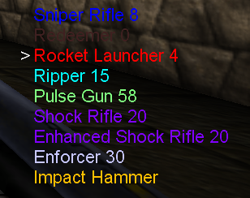

# SideWeaponList

This is a mutator for Unreal Tournament 99 that display a list of carried weapons on the right side, using the weapons default  NameColors.

## Installation

Unzip the release archive into the System folder.

## Usage
Pick the mutator in the list when starting a game.

If you wish to invert the list order, type `mutate sidelist` in the console.

